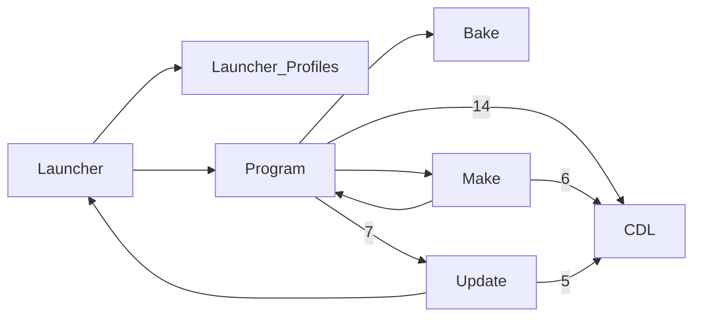

Code map: MinecraftThroughTime — 7 components, 10 call-dependencies (top); core: CDL, Launcher_Profiles, Program, Update

_Auto-generated (deterministic, no AI) from the symbol index._

## Core components (PageRank — most depended-upon)
- `CDL` — 0.296
- `Launcher_Profiles` — 0.146
- `Program` — 0.142
- `Update` — 0.122
- `Launcher` — 0.104
- `Bake` — 0.097
- `Make` — 0.092

## Call dependencies (who calls whom)

## Largest components (by member count)
- `Program` — 13 members
- `CDL` — 12 members
- `Update` — 11 members
- `Make` — 4 members
- `Launcher` — 3 members
- `FileDownloads` — 3 members
- `Launcher_Profiles` — 2 members
- `Bake` — 2 members
- `version_manifest` — 2 members
- `Vmv2` — 2 members
- `MTTProfile` — 2 members
- `ClientDownloads` — 1 members
- `ServerDownloads` — 1 members
- `MTTProfileEntry` — 1 members
